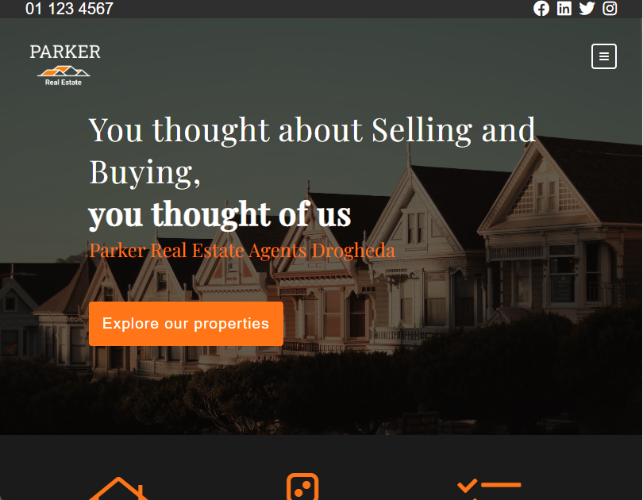

# Real Estate Clone

This is a project built with PHP and MySQL. Feedback and questions are welcome!

## About
This is a real estate website I built inspired by a website I saw (https://www.mtsproperty.com/). It has a main page, an about page, a contact form, sales and lettings. The information from the properties displayed on the website comes from a database. There is also an admin area, where it is possible to add/modify/delete the properties. There is a user admin panel that only admin users can access.

## Tech/framework used
Built with:
* PHP
* MySQL
* AJAX
* HTML5
* JS
* PHPMailer

## Demo
The website is deployed at https://real-estate-website-clone.herokuapp.com/index.php
